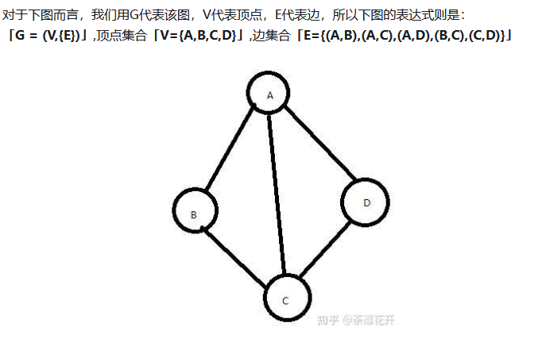

# 算法总结

## 数
### 二叉树
二叉搜索树（BST） 的中序遍历结果是有序的

### 多叉树
多叉树没有了中序位置，因为可能有多个节点嘛，所谓的中序位置也就没什么意义了。

## 图
图中的元素被称为顶点（Vertex），顶点与顶点之间连线被称为边（Edge），每个顶点有多少连线被称称为度（Degree）

在有向图中，指向这个顶点的边和从其出发的边是不一样的，所以用**出度（Out-degree）**和**入度（In-degree）**来具体描述顶点的度。
    - **出度**指的是有多少边是从当前顶点出发指向其他顶点；
    - **入度**指的是有多少边指向当前顶点

### 分类
    - 无向图
    - 有向图
    - 无向完全图
    - 有向完全图
    - 连通图、强连通图
    - 网

### 无向图
无向图 的定义很简单，看名字大致上都知道这个**图不存在方向**。也就是顶点和顶点之间只存在一条「边」
**无向边**：若顶点 「A」 和 「B」 之间的边没有方向，则叫做「无向边」；如果任意两个顶点之间的边都是无向的，则叫该图为「无向图」

### 有向图
有向图的意思是说，存在一条「弧」（也可以叫「有向边」），在任意两个顶点中，称为有向图
**有向边或弧**：若顶点 「A」 和 「B」 之间的边有方向，则叫做「有向边或弧」，如果任意两个顶点之间的边都是有向的，则叫该图为「有向图」

### 无向完全图
在无向图的定义中，增加了一条规矩，若「任意两个顶点存都存在边，则称为无向完全图」

### 有向完全图
在有向图的定义中，也增加了一条规矩，若「任意两个顶点之间都存在方向互为相反的两条弧，则称该图为有向完全图」

### 连通图
**连通图**：在无向图中，如果顶点A到顶点B之间有路径，就说A和B是连通的，如果说任意两顶点都是连通，则称为连通图

### 强连通图
在有向图里，如果「每一对」顶点，都有「A->B 或 B->A」的路径，就称为是强连通图

### 带权图
描述边与边的权重的图

### 网

### 图的存储
这里讲解2种比较常见的（剩下很多种，都是基于邻接表的改良）
- 邻接矩阵
- 邻接表

#### 邻接矩阵
是把图描述成一个数组的形式，使用两个数组讲图的顶点和边的集合进行一个结构体整合。

需要注意的是, 矩阵的对角线上的数据都为0

需要注意的是，在有向图里因为是有方向性的，因此要注意他的「入度」跟「出度」 「纵向」代表着某个顶点的「入度」，「横向」代表着某个顶点的「出度」

#### 邻接表
我们使用 「^」 去代表这个节点是最终的节点了，我们把A的连通顶点的边都使用变脸去串起来。最后的节点则使用终结符 「^」 代表

我们只记录有向图的「出度」,与无向图的记录方式
一致

### 算法
1、广度优先搜索（BFS）
2、深度优先搜索（DFS）
3、最短路径算法（Dijkstra）
4、Prim算法
5、Kruskal算法

